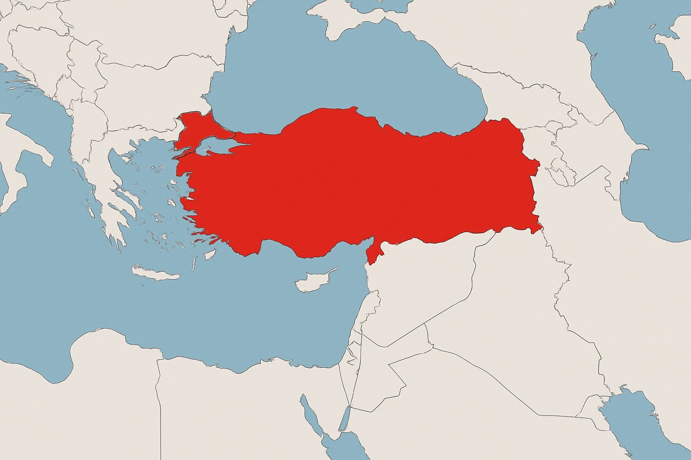

# 🌍 Türkiye ve 10 Farklı Ülkenin Karşılaştırmalı Analizi (2005-2025) [TR]



Bu proje, 2005-2025 yılları arasında **11 ülkenin** (Turkey, Germany, Japan, Brazil, Poland, United Kingdom, Canada, Jordan, Sweden, South Korea, Malaysia) çeşitli alanlardaki gelişim skorlarını incelemeyi amaçlar. 

Projenin odaklandığı 5 ana kriter:
- 🎓 Education Score
- 🎭 Culture Score
- 🗽 Freedom Score
- 🔬 Scientific Contribution Score
- ⚖️ Ethic Score

## 📂 Veri Setleri ve Yapı
- **Kaynak veri setleri:** Google Trends,PISA,THE University Rankings,Freedom House,RSF,ScimagoJR,WorldBank R&D Expenditure,Unesco,CPI,WJP
- **Düzenlenmiş veri setleri:** Çeşitli `.csv` dosyaları (ör. overall_score.csv).
- **Kod dosyaları:** Python scriptleri (`overall_freedom_score.py`, `rsf_score_graph.py`, vb.)  
- **Grafikler:** Proje boyunca elde edilen analiz sonuçları.

## 🚀 Çalıştırma
Projede kullanılan her `.py` dosyası, dosya isminden anlaşılacağı gibi belirli bir analiz/grafik veya verilerin düzenlenmesi için yazılmıştır.  
- Örneğin: `rsf_score_graph.py` dosyası, **11 ülkenin RSF skorlarının yıllar içindeki değişimini** çizer.

💡 **Kullanım için öneriler:**
1. İlgili `.csv` yada `.xlsx` dosyalarının `.py` dosyası ile aynı klasörde olduğundan emin olun.
2. Python ortamında:  
```bash
python rsf_score_graph.py
```
## Sonuçlar ve Değerlendirme


Türkiye'nin genel bir düşüş sergileyeceği ve gelişmiş Dünya ülkelerinin yükseliş sergilemesi beklenirken sonuçlarda Türkiye kadar olmasa da Dünya ülkelerinde bir düşüş gözlemlenmiştir.
Bunun sebebi bir çok farklı şekilde yorumlanabilir.Verilen kriterlerdeki grafiklerin analizlerinden de bu sonuçların yorumlanabilmesi mümkündür.

- Örneğin: Avrupa ülkelerindeki özgürlük skorunun düşüşün sebebi son 20 yıldır karşımıza çıkan mülteci problemleri olabilir.

Bunun gibi yorumlamalar yaparak sonuçlar somut ve gerçek nedenlere dayandırılabilir.

**Detaylı analiz** için `Türkiye'nin Sosyal Gelişiminin Analizi Raporu-Report` dosyasını inceleyebilirsiniz.


# 🌍 Comparative Development Analysis of Turkey and 10 Different Countries (2005-2025) [EN]


This project aims to examine the development scores of **11 countries** (Turkey, Germany, Japan, Brazil, Poland, United Kingdom, Canada, Jordan, Sweden, South Korea, Malaysia) in various fields between 2005 and 2025.

The project focuses on 5 main criteria:
- 🎓 **Education Score**
- 🎭 **Culture Score**
- 🗽 **Freedom Score**
- 🔬 **Scientific Contribution Score**
- ⚖️ **Ethic Score**

## 📂 Datasets and Structure
- **Source datasets:** Google Trends, PISA, THE University Rankings, Freedom House, RSF, ScimagoJR, WorldBank R&D Expenditure, Unesco, CPI, WJP
- **Processed datasets:** Various `.csv` files (e.g., `overall_score.csv`).
- **Code files:** Python scripts (`overall_freedom_score.py`, `rsf_score_graph.py`, etc.)
- **Graphs:** Results of analyses throughout the project.

## 🚀 Running the Project
Each `.py` file in the project has a clear and descriptive name, indicating its purpose (analysis, graph plotting, or data processing).  
- For example: The `rsf_score_graph.py` file **plots the changes in RSF scores over the years** for the 11 countries.

💡 **Usage Tips:**
1. Make sure the relevant `.csv` or `.xlsx` files are in the same directory as the `.py` file.
2. In your Python environment:  
```bash
python rsf_score_graph.py
```


It was expected that Turkey would show a general decline, while developed countries would show an upward trend. However, the results revealed that even these countries exhibited a decline — although not as sharp as Turkey’s.
This decline can be interpreted in various ways. By analyzing the graphs for each criterion, you can identify possible explanations for these trends.

- For instance:The drop in freedom scores in European countries could be linked to the refugee issues that have been prominent in the last 20 years.

Such interpretations ground the observed trends in concrete, real-world causes.

For a **detailed analysis**, please refer to the `Türkiye'nin Sosyal Gelişiminin Analizi Raporu-Report` file.
